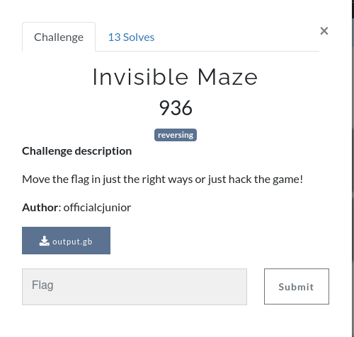
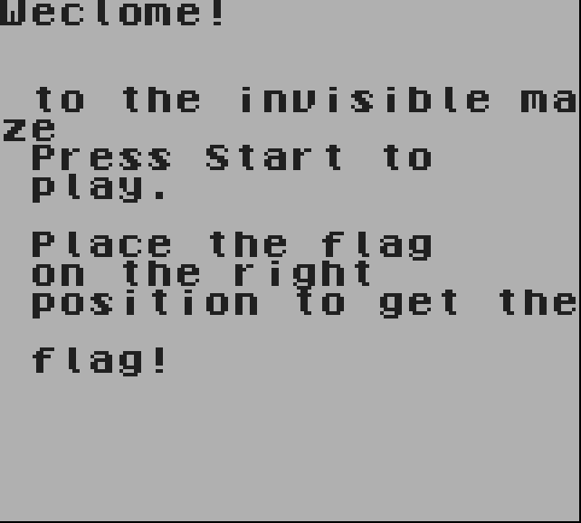
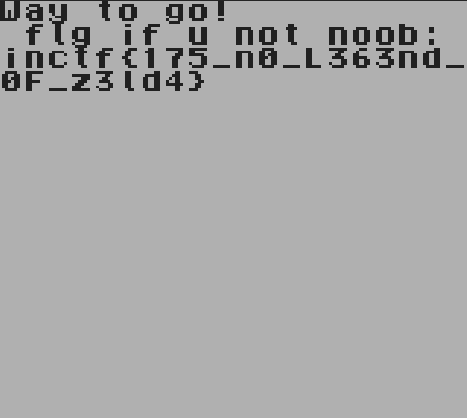

For inCTF International Edition 2020, I had so much fun in making a Gameboy ROM reversing challenge.

This is the writeup for the same.

## Invisible Maze

**tl;dr**
+ Challenge is a Nintendo GameBoy ROM image.
+ Reverse the ROM and figure out the implementation
+ Analyze the calling function's checks to find the path along which we must move.

**Challenge points**: 936

**No. of solves**: 13

**Challenge Authors**: officialcjunior and [k4iz3n](twitter.com/akulpillai)

You can get the challenge file from [here.](https://github.com/teambi0s/InCTFi/tree/master/2020/Misc/Invisible-Maze)

---

## Challenge Description

Move the flag in just the right ways or just hack the game!



## Initial Analysis

We are provided with a single file: a 256Kbit Game Boy ROM image.

In the absence and impracticability of using the actual hardware, we'll load it up on a GameBoy emulator.



After the splashscreen, you'll be greeted with the challenge description and then, a screen with a movable flag. Briefly speaking, we just need to find where the checks are being done, which in turn track the movement of the flag.

On further reversing, you'll find checks like the one below, quite often.

```
	0x00000ace      fe0f           cp 0x0f
	0x00000ad0      c2fd0a         jp nZ, 0x0afd
	0x00000ad3      1803           jr 0x03
	0x00000ad5      c3fd0a         jp 0x0afd
	0x00000ad8      f805           ld hl, sp + 0x05                          
	0x00000ada      7e             ld a, [hl]                       
	0x00000adb      fe0a           cp 0x0a
```
Adding this to what the description suggests, we can imply that they are checking the positon of the flag on the screen. And going 15 pixels to the right and 10 down from zero, which is at the top left corner, the game makes a different beep comapared to the normal beep.

Similarly, while moving through the other five positions, the game makes the different beep. They are the positions through which the flag must be moved.

After passing through all the checks, you'll be greeted with the flag.



## Side note

It can also be inferred that at the function at `0x0000200` is the one which is generating and printing the flag. And the arguments passed to it, the position of the flag, are of the type Ubyte (8 bit unsigned bytes), which makes it possible to brute force all the possible combinations.

## Flag

**FLAG**: `inctf{175_n0_L363nd_0F_z3ld4}`