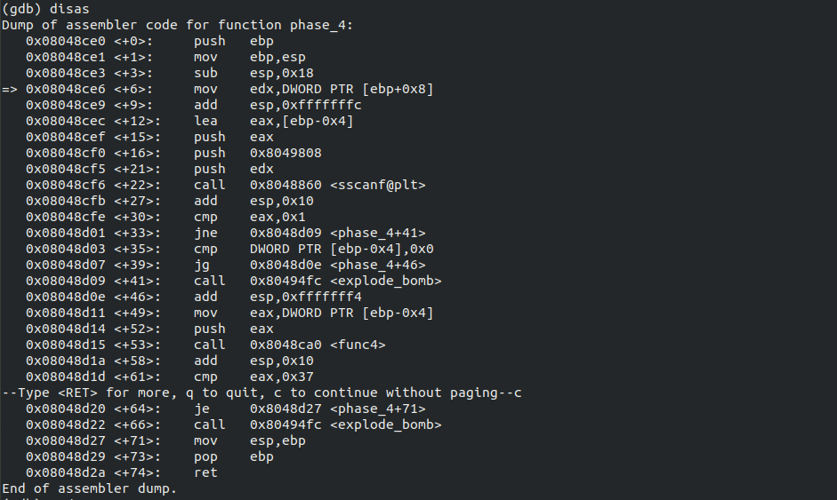
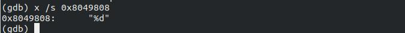
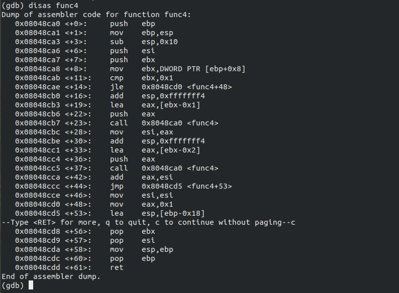
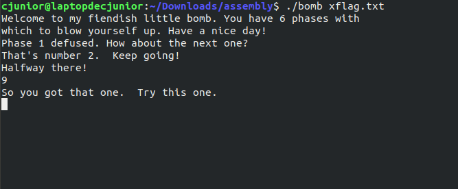

# Solving Binary Bomb Lab challenges

Hello!

Here, we're going to solve Phase-4 of the Bomb Lab.

If you were looking for some other phases, click on the link below.
  * [Phase -1](https://officialcjunior.github.io/Binary-Bomb-Lab-Phase-1/)
  * [Phase -2](https://officialcjunior.github.io/Binary-Bomb-Lab-Phase-2/)
  * [Phase -3](https://officialcjunior.github.io/Binary-Bomb-Lab-Phase-3/)
  * [Phase -5](https://officialcjunior.github.io/Binary-Bomb-Lab-Phase-5/)
  * [Phase -6](https://officialcjunior.github.io/Binary-Bomb-Lab-Phase-6/)

_________________


First things first, open up the file in GDB and disassemble `phase_4` after entering something as input.





Looking at the code, just like the one before, we can see a memmory address being explicitly pushed into `scanf`. Let's take a look at what's inside.



&nbsp;

Alright, so all we have to do is input an integer.


After checking whether the integer is greater than 0 or not in line `<+35>`, the integer is moved onto `eax` and then fed into `<func4>` as an input at line `<+49>`. And after `<func4>` returns, `eax` being compared to 0x37, which is 55 in decimal. 

In other words, we have to input the correct integer and make `<func4>` return 55.

Now, let's see what `<func4>` is doing with our number.




As you can see here at line `<+23>` and `<+37>`, it's calling `<func4>` again, making this recursive.

So, as we're sure about `<func4>` calling itself, there must be a condition check somewhere near the beginning which forbids `<func4>` from ending up like a paradox.
We can see something exactly like that at line `<+13>` where the input is compared to 1 and is `jmp`-ed to line `<+48>` where `eax` is loaded up with 1, again.


And just before the program goes for recursion, we can see an integer, particularly `input-1` and `input-2` being pushed at line `<+19>` and `<+33>`, respectively. After that, the results are added at line `<+42>` and saved to `eax`, which is returned back later.

Let us just write that in some other programming language to get a clear idea of what's going on.

```def func4(n): 
	   if n<2:
	   	   return n:
	   else
		   return func4(n-1)+func4(n-2)

```
which acutally reminds me of a famous pattern none other than the [Fibonacci sequence](https://en.wikipedia.org/wiki/Fibonacci_number), where each element of the series is the sum of two of the previous elements.

So, what should we enter to return 55? from `<func3>`?

We must acknowledge the fact that here, if we input 0 or 1 to `<func4>`, it's essentially just returning 1, so we must input the Fibonacci number of 55 with 1 subtracted from it.


Entering **9** as the password, 





and voila!


