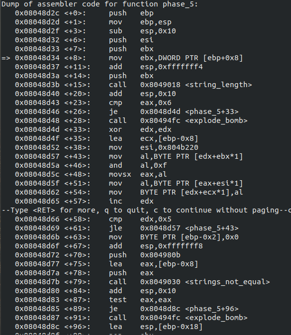
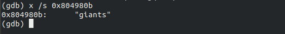
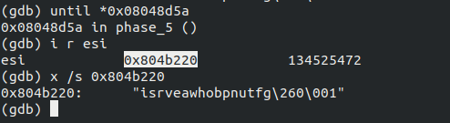
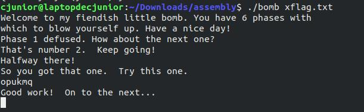

# Solving Binary Bomb Lab challenges

Hello!

Here, we're going to solve Phase-5 of the Bomb Lab.

If you were looking for some other phases, click on the link below.
  * [Phase -1](https://officialcjunior.github.io/Binary-Bomb-Lab-Phase-1/)
  * [Phase -2](https://officialcjunior.github.io/Binary-Bomb-Lab-Phase-2/)
  * [Phase -3](https://officialcjunior.github.io/Binary-Bomb-Lab-Phase-3/)
  * [Phase -4](https://officialcjunior.github.io/Binary-Bomb-Lab-Phase-4/)
  * [Phase -6](https://officialcjunior.github.io/Binary-Bomb-Lab-Phase-6/)

_________________

`disassemble`-ing `<phase_5>` we get,



Alright. 

At line `<+15>`, we can see a call to `<string_length>`, which returns the length of the string. And beneath the call, we can see `eax`, which is returned by the function, being compared to 6. So, our string must be six characters long.

As we read through, we can see a loop occuring at line `<+61>`, where it takes us back to line `<+43>` six times, with six of our characters , to which we'll get into, later. For the time being, see this loop as an encoder.

After that, we can see a fixed address `0x804980b` being pushed along with our encoded string to `<strings_not_equal>` and if they are equal, we jump over to line `<+96>` where we exit the function.

So, let's just see what lies inside `0x804980b`.



So, our input string is getting transformed into 'giants', somehow.
We just have to figure out how and for that, we go back and see what's that loop we talked about earlier, is doing to our string.

_________________ 

At line `<+43>`, we have our input, the string inside `ebx` and as `edx` is getting increment each iteration of the loop, each character is moved into `al` each iteration. Then, it is **AND**-ed with 0xf, which is 55 in decimal, bitwise. Then, we can see that the result is moved into `eax`, and the element in `eax`-th location in `esi` is moved into the location of the input string.

For us to move forward, we must see what's inside `esi` during the loop.

Let's use `until` to move till the line where the loop begins, and print what's inside `esi`.

We get:



Let's write this loop in some other language for a clearer view.

```
s=input()
esi='isrveawhobpnutfg'
password=""  #'giants'
for i in range (5):
	index = s[i] and 0xf
	password += esi[index]
```
_________________ 


It's worth nothing that 0xf is 15 and the index of the string in `esi` ranges from 0 to 15.

And `AND`-ing with 0xf is basically just extracting the last four bits of the binary representation. That is, whatever may be an input, the cipher works and therefore, there can be many solutions to `<phase_5>`

As we discussed above, `AND` is a bitwise operation.

Say, you need index as 1. So,
>   00000001 and 00001111

which gives us,

>   00000001

Even if you `AND` 0xff with 0xf, you'll still get the same result.


So, `AND` is only going to cut the most significant hex digit.

_________________ 

Our first letter of the password is 'g'. It lies on the 15-th index of the string in `esi`. So, we must find a character whose ASCII representation when AND-ed with 0xf returns 15.

So, 0x2f,0x3f,0x4f... satisfies the condition.

In the [ASCII table](https://www.asciitable.com/index/asciifull.gif), the letter 'o' 0x6f is one of such value.

So, 'o' can be the first character of our password.
_________________ 


Similarly, we can reverse the cypher and figure out the the next five characters.

One of the answers ends up being **'opekmq'**.



Onto the final phase, we go!
